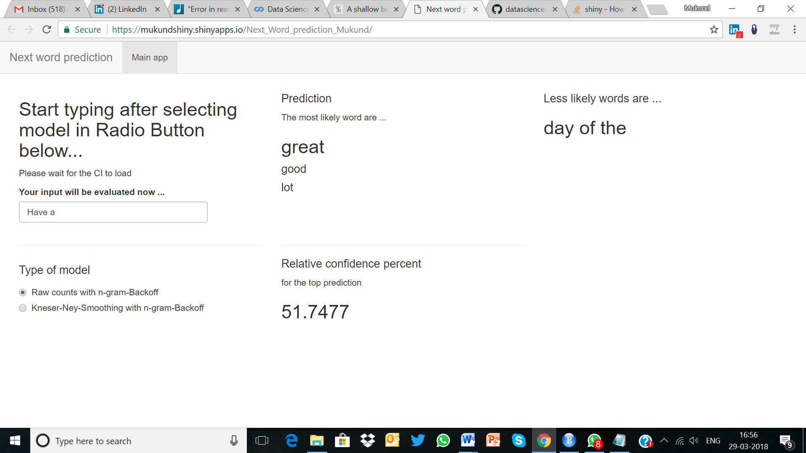

Mukund Capstone project
========================================================
author: Mukund K.V
date: 29-03-2018
autosize: true

Summary
========================================================

For more details on authoring R presentations please visit <https://support.rstudio.com/hc/en-us/articles/200486468>.

- As part of Coursera Data Science specialization capstone, created a Shiny Web application for Next work Prediction
- This application is based on NLP algorthims, and can be used in various domain and fields.
- Simple UI and powerful Intutition, both for Most likely and less likely Word predictions 
- Also shows Confidence levels for most likely words thus giving instant validation.

Appraoch Taken
========================================================
- large corpus of Twitter, Blog and News data was downloaded and cleaned ( removal of ) before turning it into training corpus
- Training corpus was sampled judiciously and multiple times to get better accuracy without overfitting.
- To increase speed, used parallelization and kept the Workspace clean not using instances of data unnecessarily.
- To increase speed, used parallelization and kept the Workspace clean not using instances of data unnecessarily.
- Started with a simple back off algorithim, going from 4- gram down to one word, if input is not found in higher   gram respectively.
- Used Kneser-ney for smoothing and back off with kneser ney. Kneser is known to best for smoothing.
- Used Skip grams gram 5 and gram 6 for unknown words.
- Confidence interval has been chosen as stastical validation tool.

Application
========================================================

- First Select the model you want to choose for Next Word prediction ( back off or Kneser-Ney)
- Start typing in the text box
- You will see top 3 likely words and next least likely words in screen.
- You will also see a score for likely words in Bottom.

Conclusion and Way forward
========================================================
- More Work needs to be done on accuracy. In spite of smoothing and skip grams accuracy is not good
- Found that sometimes simple back off works better than Kneser-ney
- Training sample tuning could perhaps give better result, but there is a  lapptop performance and overfitting      constraint.
- References 
-- Kneser ney https://nlp.stanford.edu/~wcmac/papers/20050421-smoothing-tutorial.pdf
-- Kat'z back off https://en.wikipedia.org/wiki/Katz%27s_back-off_model
